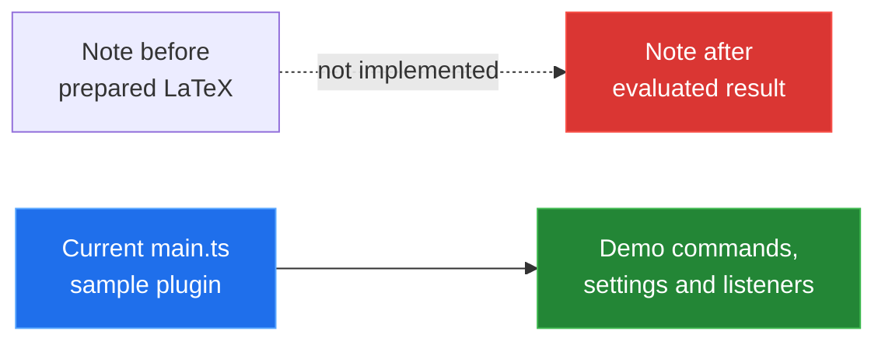
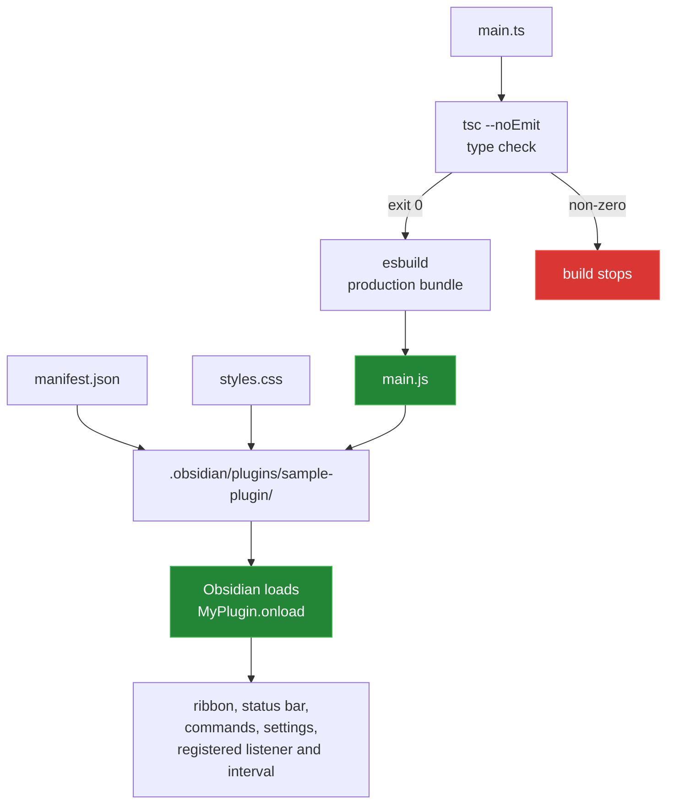

# obsidianMathsExecutor

`obsidianMathsExecutor` is named for an Obsidian plugin that would evaluate
prepared LaTeX maths expressions in a vault. At the current commit it is still
the Obsidian sample-plugin scaffold: it builds, registers demonstration UI and
commands, and does not parse notes, evaluate maths, or write evaluated results
back to a note. This README documents the code that is present and makes the
missing execution path visible.



The before/after path is the name's intended shape, not a recording of current
behaviour. No current command evaluates note content or performs that
before/after transform.

## Quick start

The development commands below were run successfully in this checkout with
Node `v24.10.0` and npm `11.19.0`:

```sh
npm install
npm run build
```

The build type-checks `main.ts` and writes the generated `main.js`. To rebuild
on every source change during development:

```sh
npm run dev
```

For a manual install, build first, then copy the generated bundle, manifest and
stylesheet into a vault plugin directory. The current manifest id is
`sample-plugin`, not `obsidian-maths-executor`:

```sh
VAULT=/path/to/YourVault
PLUGIN_DIR="$VAULT/.obsidian/plugins/sample-plugin"
mkdir -p "$PLUGIN_DIR"
cp main.js manifest.json styles.css "$PLUGIN_DIR/"
```

Enable **Sample Plugin** under **Settings → Community plugins**. Copying files
and enabling the plugin in a running Obsidian app was not verified here; see
[`docs/measurement.md`](docs/measurement.md).

The package declares `obsidian: latest`; the installed API package in the
verification run was `1.13.1`. The manifest declares `minAppVersion` `0.15.0`.

## Architecture

The checked-in code has a build-and-load path, not a maths execution path:



`obsidian`, Electron, CodeMirror, Lezer and Node built-ins are marked external
by `esbuild.config.mjs`; Obsidian supplies those modules at runtime. The
current `main.ts` is the sample plugin's runtime entry point.

## Capability surface

| Capability | Evidence in the current source | Status |
|---|---|---|
| Obsidian lifecycle | `Plugin.onload` and `Plugin.onunload` | Present |
| Demo UI | Ribbon icon and desktop status bar item | Present |
| Commands | Three sample command callback shapes | Present, sample only |
| Settings | One `mySetting` field saved through `data.json` | Present, sample only |
| Note parsing | No vault or Markdown parser code | Not present |
| LaTeX extraction | No expression marker or extractor | Not present |
| Maths functions/operators | No evaluator or operator table in source | None supported |
| Evaluated write-back | Only a fixed sample editor replacement | Not present |

In particular, the source defines no supported maths functions or operators.
The full boundary and the desired execution flow are documented in
[`docs/03-maths-executor-status.md`](docs/03-maths-executor-status.md).

## Measured results

The measurements below come from [`tools/measure.py`](tools/measure.py) and
[`tools/verify_template.py`](tools/verify_template.py), run after
`npm install`:

| Check | Observed result |
|---|---:|
| Type check | exit 0, clean |
| ESLint run | exit 0, clean |
| Production build | exit 0, clean; 1.8 seconds in the recorded run |
| `main.ts` | 3,877 bytes, 134 lines |
| Generated `main.js` | 3,650 bytes, 3.6 KiB |
| Template comparison | 13 of 14 files identical; `README.md` is the one changed file |

The build times are wall-clock observations from one local run, not performance
guarantees. The measurement method and all quoted toolchain versions are in
[`docs/measurement.md`](docs/measurement.md).

## Repository layout

```text
main.ts              sample Obsidian plugin entry point
manifest.json        plugin id, version and minimum app version
styles.css           stylesheet shipped with the plugin
esbuild.config.mjs   development watcher and production bundler
package.json         npm scripts and development dependencies
tsconfig.json        TypeScript compiler configuration
version-bump.mjs     version lifecycle helper
versions.json        plugin version to minimum app version mapping
docs/                component write-ups and measurement method
tools/               reproducible measurement and template checks
```

`main.js` is generated and ignored by git. There is no committed `src/` tree,
test suite, CI workflow, or `media/` directory in this checkout.

## Known limitations

- The maths executor is not implemented. Notes are not parsed, expressions are
  not evaluated, and results are not written back.
- `manifest.json` and `package.json` still identify the project as the sample
  plugin. The current installed plugin id is `sample-plugin`.
- `obsidian` is declared as `latest`, and no lockfile is committed, so a fresh
  install can resolve different API typings over time.
- The sample registers a global click logger and a five-minute interval. Both
  are automatically cleaned up by Obsidian, but neither is maths functionality.
- The declared minimum app version has not been tested against a running
  Obsidian release in this pass.
- No real plugin animation or screenshot is included: capturing one requires a
  running Obsidian vault, which was not available for this pass.
