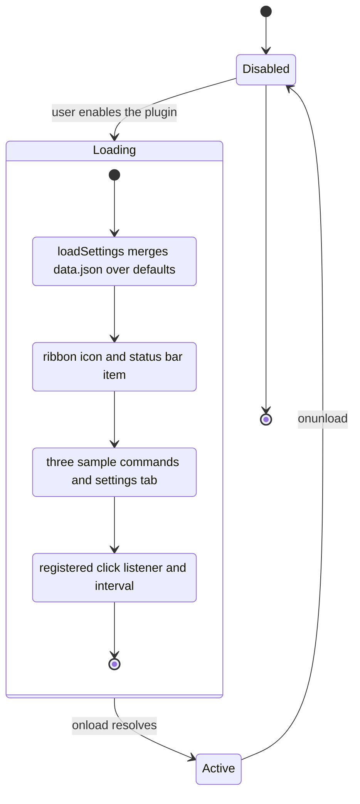
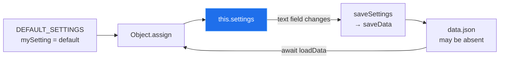

[← back to the overview](../README.md)

# The scaffold: what `main.ts` actually does

[`main.ts`](../main.ts) is the Obsidian sample plugin entry point. The source
measurement recorded 3,877 bytes and 134 lines, and the lint command completed
with no diagnostics. The template verifier reports that this source file still
matches the upstream sample snapshot.

## Lifecycle

Obsidian instantiates the default-exported `MyPlugin`, awaits `onload`, and
later calls `onunload` when the plugin is disabled. The current `onunload` is
empty because the registrations use Obsidian's cleanup-aware APIs.

## What `onload` registers

| Call | Observable result | Cleanup |
|---|---|---|
| `addRibbonIcon` | A `dice` ribbon icon shows a notice when clicked | Obsidian-managed |
| `addStatusBarItem` | Static `Status Bar Text` on desktop | Obsidian-managed |
| `addCommand` | Simple modal, editor replacement and conditional modal commands | Obsidian-managed |
| `addSettingTab` | A settings page for `mySetting` | Obsidian-managed |
| `registerDomEvent` | Logs every document click | Removed on unload |
| `registerInterval` | Logs `setInterval` at the configured interval | Cleared on unload |

The editor command reads the current selection for logging and replaces it with
the fixed string `Sample Editor Command`. It does not parse LaTeX or calculate
a result. The command is useful as an example of the editor callback shape,
not as executor behaviour.

## Settings flow

Settings are stored as one object in the plugin's `data.json`. On load, the
stored object is shallow-merged over `DEFAULT_SETTINGS`; changing the one text
field calls `saveData`.

Because the merge is shallow, nested future settings would need their own
defaulting strategy. The current setting is flat.

## Why this matters for the maths work

The scaffold provides an editor command and a settings tab, but no code path
from a vault note to an evaluator. A future implementation would need to add
that path explicitly; it cannot be inferred from the existing sample commands.

[Next: Build and install →](02-build-and-install.md)
