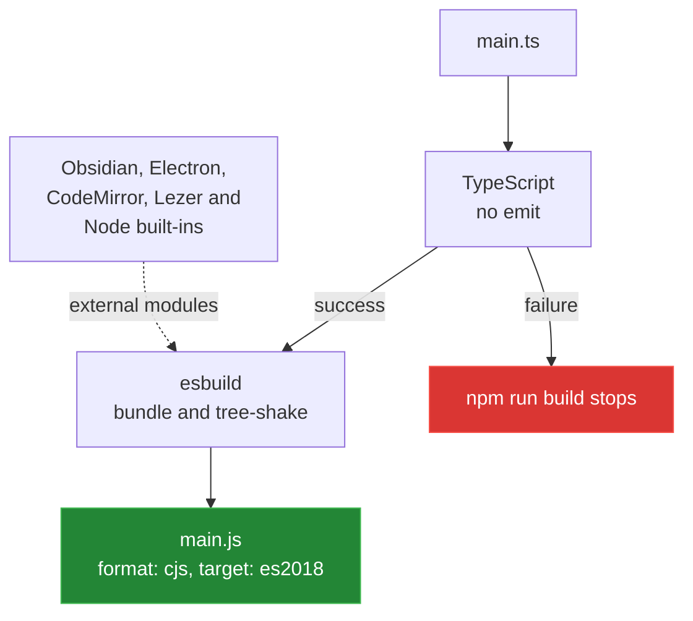

[← back to the overview](../README.md)

# Build and install

The repository has one development watcher and one production build. Both use
the same esbuild configuration; only the production argument changes whether
the process watches or performs one rebuild and exits.

| Script | Command | Behaviour |
|---|---|---|
| `npm run dev` | `node esbuild.config.mjs` | Watch and rebuild `main.js` with inline source maps |
| `npm run build` | `tsc -noEmit -skipLibCheck && node esbuild.config.mjs production` | Type-check, then emit one production bundle |
| `npm version` | `node version-bump.mjs` plus npm's version step | Update version metadata and stage manifest files |

## Build pipeline



`esbuild.config.mjs` leaves the external modules as runtime imports. Obsidian
provides them when it loads the plugin. The generated bundle is ignored by git
and must exist before a manual install.

## API version boundary

The manifest declares `minAppVersion` `0.15.0`. The package manifest declares
the `obsidian` development dependency as `latest`; the installed package in the
recorded verification run was `1.13.1`. These are different boundaries:

- `minAppVersion` is the app version the plugin claims to support.
- The `obsidian` package supplies the TypeScript API declarations used while
  building this checkout.

The repository does not pin those API declarations in a committed lockfile, so
future installs may type-check against a newer package.

## Manual installation

Run this from the repository root after a successful production build:

```sh
VAULT=/path/to/YourVault
PLUGIN_DIR="$VAULT/.obsidian/plugins/sample-plugin"
mkdir -p "$PLUGIN_DIR"
cp main.js manifest.json styles.css "$PLUGIN_DIR/"
```

Then enable **Sample Plugin** in **Settings → Community plugins**. Restricted
mode must allow community plugins. After a rebuild, reload Obsidian or toggle
the plugin off and on so the app reads the new bundle.

This installation path was documented from the manifest and build files. A
running Obsidian app was not available for a live enable/reload check; the
limitation is recorded in [`measurement.md`](measurement.md).

## Versioning

`version-bump.mjs` reads the current `minAppVersion`, writes the npm version to
`manifest.json`, and adds the same version-to-minimum-app mapping to
`versions.json`. The release process itself is not automated in this checkout.

[Previous: The scaffold](01-scaffold.md) ·
[Next: Maths executor status →](03-maths-executor-status.md)
