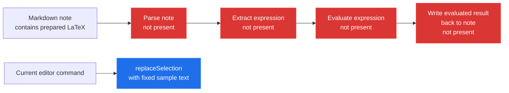

[← back to the overview](../README.md)

# Maths executor status and evaluation boundary

The repository name describes a planned feature, but the current source does
not contain an executor. There is no vault-note read, Markdown parser, LaTeX
extractor, maths evaluator, or result write-back in `main.ts` or the other
checked-in source files.

## The requested note flow

This is the execution path a real implementation would need. Every maths node
is marked as absent because no current source file implements it.

There is therefore no truthful evaluated before/after example to capture. The
current behaviour is an unchanged note: a LaTeX block remains exactly as it
was, because no command recognizes it. The only editor write is the sample
command's fixed replacement, not a calculated result.

## Function and operator surface

The supported surface is derived from source inspection, not inferred from the
repository name:

| Surface | Source evidence | Current support |
|---|---|---|
| LaTeX delimiters or markers | None | None |
| Arithmetic operators | None | None |
| Named maths functions | None | None |
| Variables or constants | None | None |
| Expression evaluation | No evaluator, `eval` or `Function` call | None |
| Note read/write | No vault read or result write-back | None |

The current plugin supports no maths functions or operators. Any documentation
that presents a list of supported expressions would be describing an
implementation that is not in this checkout.

## Security boundary

The current evaluation boundary is zero: note content never reaches an
evaluator because there is no evaluator. The plugin does not execute
expressions from note content.

If an implementation is added, it must state whether the boundary is a parser
for a deliberately limited expression language or arbitrary JavaScript
execution. A call to `eval` or `Function` on text extracted from a note would
be code execution, not a maths sandbox. The current repository makes no such
sandboxing claim and does not provide isolation.

## What to verify when this is implemented

The measurement harness should drive a real vault or editor command and record
the exact input note, extracted expression, evaluator result, and resulting
note text. Until that exists, the graphical documentation uses Mermaid
diagrams only and does not present a fabricated run or animation.

[Previous: Build and install](02-build-and-install.md) ·
[How the measurements work →](measurement.md)
