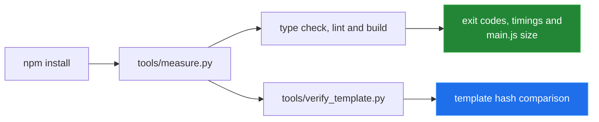

[← back to the overview](../README.md)

# How this was measured

Every number in the documentation comes from either a command run in this
checkout or a value read directly from a checked-in source file. No Obsidian
runtime result, evaluator result, or performance estimate is presented as a
measurement.

## Reproduction commands

From the repository root:

```sh
npm install
python3 tools/measure.py
python3 tools/verify_template.py
```

`npm install` completed successfully in the recorded run. The two Python
scripts use only the standard library. `measure.py` requires the installed npm
toolchain; `verify_template.py` compares the source files against the template
hashes embedded in the script.



## What `measure.py` does

The script:

1. Reads each listed source file with `Path.read_bytes()`, counts bytes and
   newline characters, and prints those values.
2. Reads package versions from `node_modules/<package>/package.json`.
3. Runs the type check, lint command and production build as subprocesses.
4. Measures each subprocess with a monotonic clock and checks for `main.js`.

The recorded toolchain was:

| Package | Resolved version |
|---|---:|
| `obsidian` | `1.13.1` |
| `typescript` | `4.7.4` |
| `esbuild` | `0.17.3` |
| `eslint` | `8.57.1` |
| `@typescript-eslint/parser` | `5.29.0` |
| `tslib` | `2.4.0` |
| `@types/node` | `16.18.126` |

The recorded output was:

| Check | Exit | Recorded result |
|---|---:|---|
| Type check | 0 | clean; 0.7 seconds |
| ESLint | 0 | clean; 0.7 seconds |
| Production build | 0 | clean; 1.8 seconds |
| Generated bundle | — | `main.js`, 3,650 bytes, 3.6 KiB |

The timings are wall-clock values from one local run and can vary with the
machine. They are included to document provenance, not to define a performance
target.

## Template comparison

`verify_template.py` hashes the fourteen files listed in its
`TEMPLATE_SHA256` mapping and compares each local file with the corresponding
hash from `obsidianmd/obsidian-sample-plugin` at the commit recorded in the
script. The command reported 13 of 14 files identical, one modified file
(`README.md`), and no absent template files. The additional documentation and
tool files are reported separately as files outside that template set.

## What was not measured

The plugin was not enabled in a running Obsidian vault. Consequently this pass
does not claim that a ribbon icon appears, that the sample commands run inside
Obsidian, or that any LaTeX expression evaluates. There is no real execution
trace from which to build an animation, so the repository ships Mermaid
diagrams only and no generated media.
